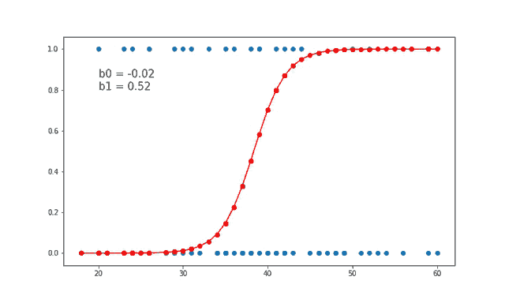

# Logistic Regression Analysis: Insurance Claim Prediction & Movie Ratings Dataset.

# Case Study-1: Insurance Claim Prediction Dataset.

• Performed logistic regression analysis on the data to explore relationship of 'insuranceclaim' target variable with other variables like age, sex, persons BMI, smoker or not, etc to check the eligibility status of insurance claim.

# Case Study-2: Movie Ratings Dataset.

• Conducted logistic regression analysis on movie ratings dataset to check the relationship between the success of a movie & the related attributes like (comments, likes-dislikes, budget of movie, number of sequels, total number of views, etc.)

#Application: 
Customer Purchases Prediction (Will purchase or not), Predictive Modeling in Logistics & Supply Chain, etc.

#

